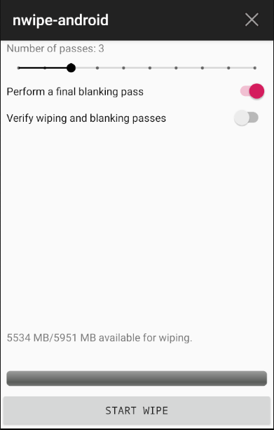
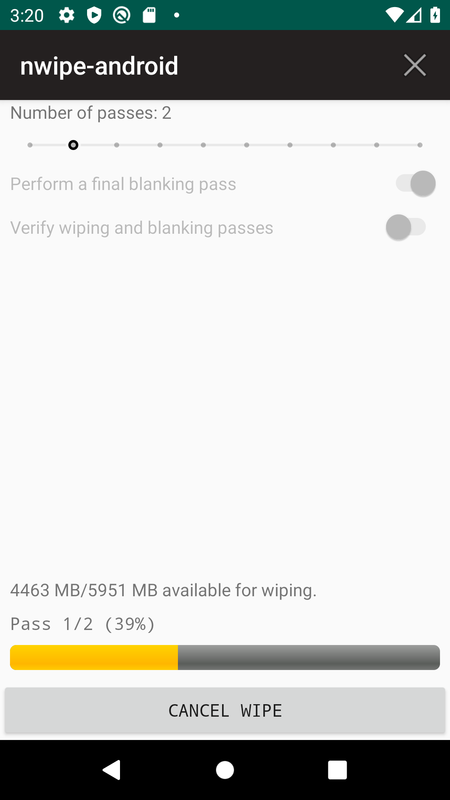
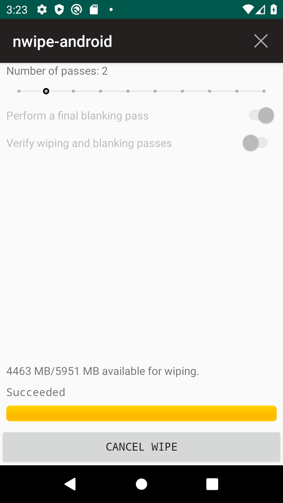

# nwipe-android

[nwipe-android](https://github.com/louib/nwipe-android) is an application to wipe the internal storage of an Android device.

**This app is still beta software.**

## Screenshots

## License

GPL-3.0
