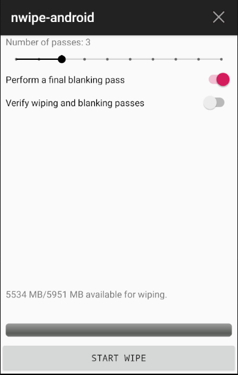
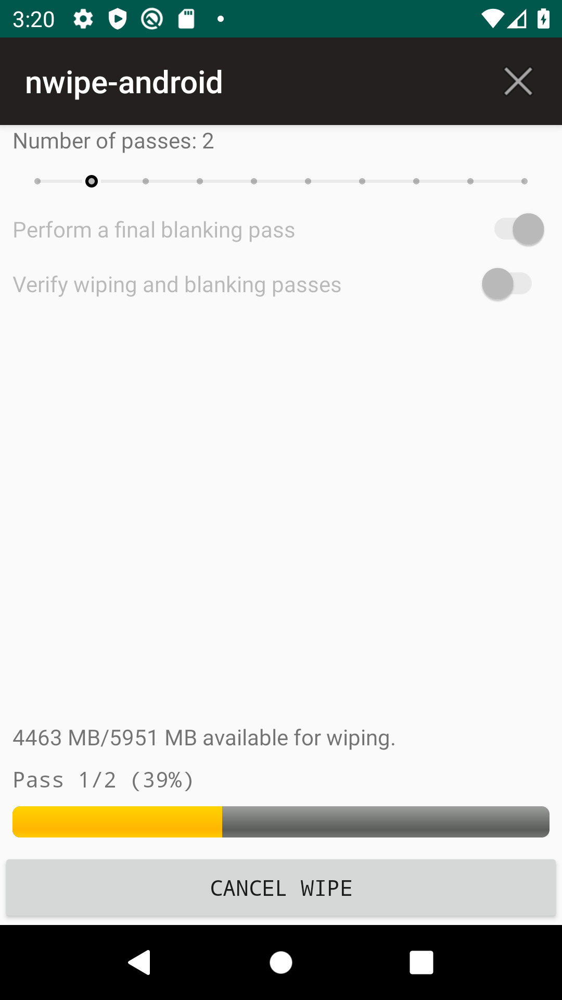
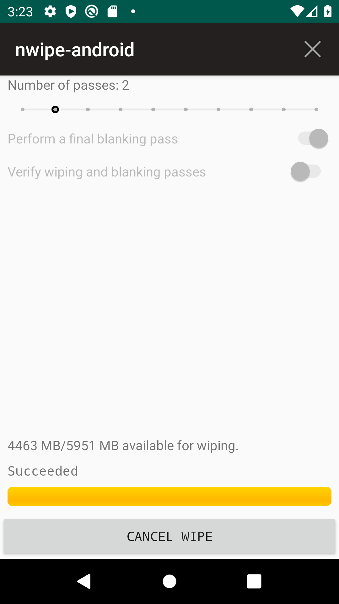

# nwipe-android


[nwipe-android](https://github.com/louib/nwipe-android) is an application to wipe the internal storage of an Android device.

**This app is still beta software.**

## Screenshots



## Build with Nix

This project includes a Nix flake for reproducible builds without requiring Android Studio.

### Prerequisites

- [Nix](https://nixos.org/download.html) with [Flakes enabled](https://nixos.wiki/wiki/Flakes).

### Build steps

1.  **Enter the development shell:**

    ```bash
    nix develop
    ```

    The shell will automatically configure `ANDROID_HOME` and update `gradle.properties` with the correct path to the Nix-provided `aapt2`.

2.  **Build the application:**

    ```bash
    gradle assembleRelease
    ```

    Or as a one-liner:

    ```bash
    nix develop .# -c gradle assembleRelease
    ```

The resulting APK will be at `app/build/outputs/apk/release/app-release-unsigned.apk`.

### Running the application

If you have an Android device or emulator connected with `adb` access, you can build, install, and run the debug version in one command:

```bash
nix develop .# -c run
```

This will:
1.  Build the debug APK.
2.  Install it on the connected device.
3.  Launch the main activity.

### Running on an emulator

If you don't have a physical device, you can create and run an emulator:

1.  **Create the emulator (one-time setup):**
    ```bash
    nix develop .# -c emu-create
    ```
2.  **Launch the emulator:**
    ```bash
    nix develop .# -c emu
    ```
3.  **Run the app (in a separate terminal):**
    ```bash
    nix develop .# -c run
    ```

### Signed Builds and App Bundles (.aab)

To produce an **Android App Bundle** (required for Google Play), run:
```bash
nix develop .# -c bundle
```

To produce a **Signed** APK or AAB without modifying the codebase, you can pass your keystore information directly to Gradle:

```bash
nix develop .# -c gradle assembleRelease \
  -Pandroid.injected.signing.store.file=/path/to/keystore.jks \
  -Pandroid.injected.signing.store.password=your_password \
  -Pandroid.injected.signing.key.alias=your_alias \
  -Pandroid.injected.signing.key.password=your_password
```

## License

GPL-3.0
